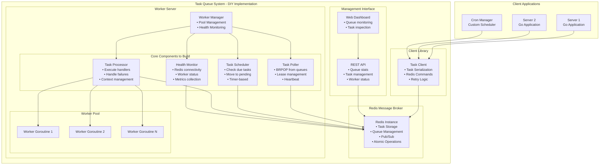
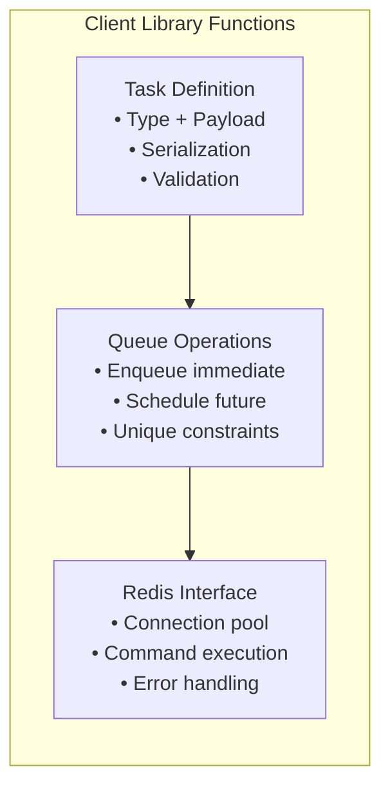
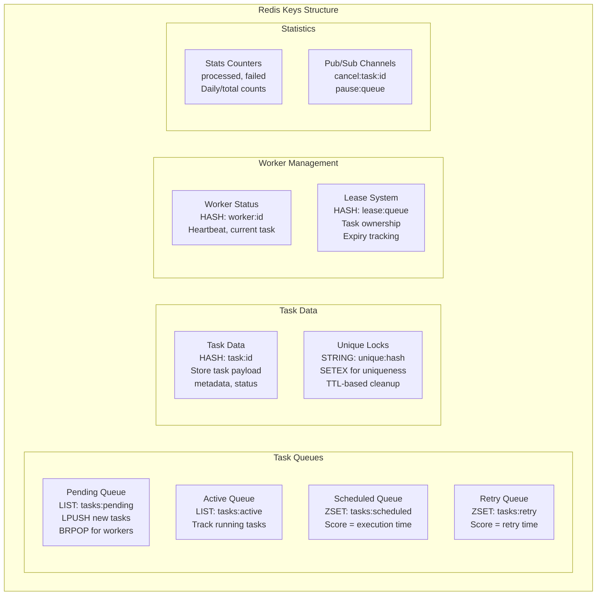
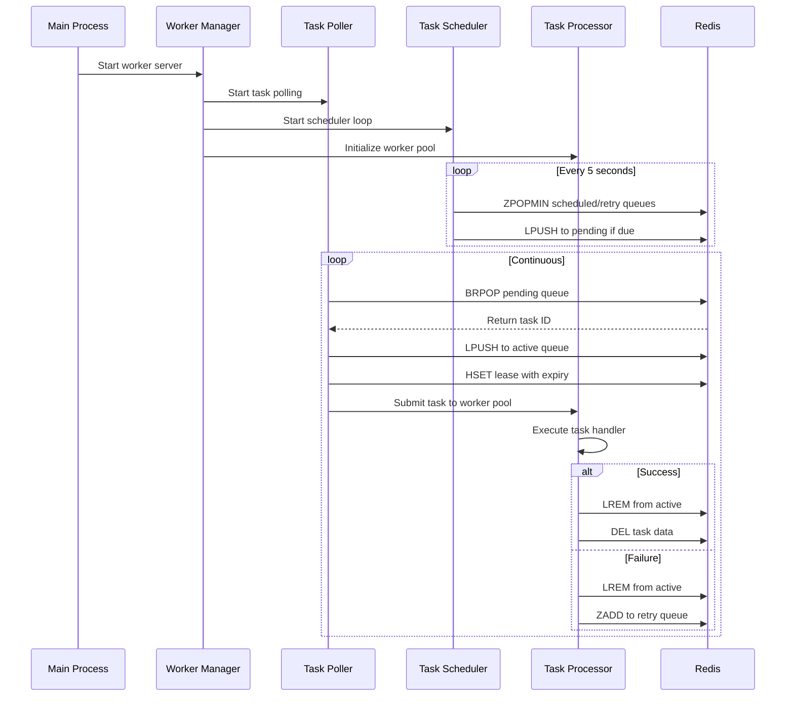
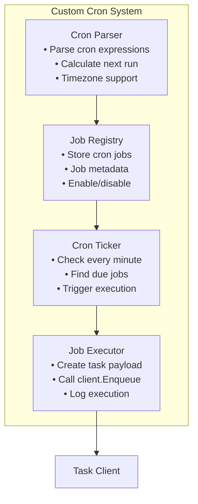
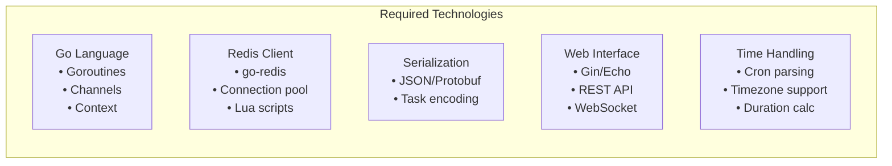
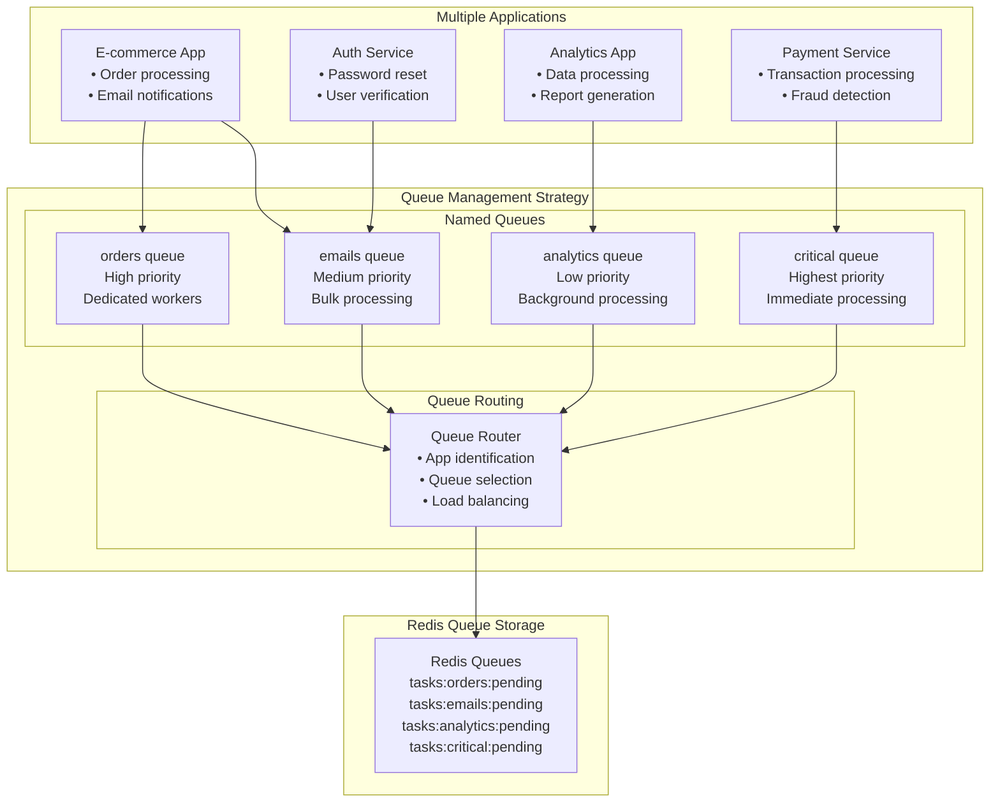
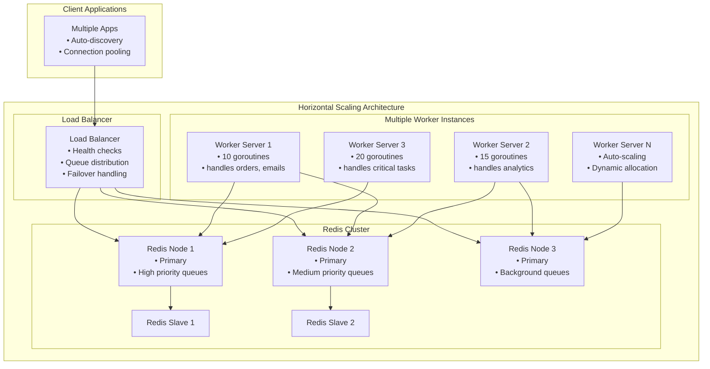

# Building a Distributed Task Queue from Scratch

This diagram shows how to recreate the Asynq-like background job service without using the Asynq library, based on the studied architecture and features.

## Core Architecture for Scratch Implementation



## Implementation Components Breakdown

### 1. Client Library Implementation



**Key Components to Build:**
- Task struct with JSON/protobuf serialization
- Redis client wrapper with connection pooling
- Enqueue methods: immediate, scheduled, unique
- Error handling and retry logic

### 2. Redis Data Structure Design



### 3. Worker Server Implementation



### 4. Cron Scheduler Implementation



## Key Implementation Challenges

### 1. Atomicity & Race Conditions
- Use Redis Lua scripts for atomic operations
- Implement proper locking mechanisms
- Handle concurrent task processing

### 2. Reliability & Recovery
- Worker heartbeat system
- Lease expiry and recovery
- Task retry with exponential backoff
- Dead letter queue for failed tasks

### 3. Scalability
- Worker pool size management
- Queue partitioning strategies
- Connection pooling
- Horizontal scaling support

### 4. Monitoring & Observability
- Task execution metrics
- Queue depth monitoring
- Worker health status
- Performance profiling

## Technology Stack for Implementation



This architecture provides a complete blueprint for building a distributed task queue system from scratch, incorporating all the features studied from Asynq: task scheduling, worker pools, cron jobs, monitoring, and reliable delivery mechanisms.

## Questions & Answers

### 1. Can this service accept jobs from multiple apps? How to handle the queues?

**Yes, the service is designed to handle multiple applications seamlessly.**



**Queue Handling Strategies:**

1. **Named Queues**: Each application or task type uses dedicated queues
   ```go
   // Different apps enqueue to different queues
   client.Enqueue(task, asynq.Queue("orders"))      // E-commerce
   client.Enqueue(task, asynq.Queue("analytics"))   // Analytics
   client.Enqueue(task, asynq.Queue("emails"))      // Notifications
   ```

2. **Priority-Based Processing**: Different queues can have different priorities
   ```go
   // Worker configuration
   server := asynq.NewServer(redisOpt, asynq.Config{
       Queues: map[string]int{
           "critical":  6,  // Highest priority
           "orders":    4,  // High priority  
           "emails":    2,  // Medium priority
           "analytics": 1,  // Low priority
       },
   })
   ```

3. **Application Isolation**: Separate Redis databases or key prefixes per app
   ```
   app1:tasks:pending    // E-commerce tasks
   app2:tasks:pending    // Analytics tasks
   app3:tasks:pending    // Auth service tasks
   ```

4. **Multi-tenancy Support**: App identification in task metadata
   ```go
   type TaskPayload struct {
       AppID    string `json:"app_id"`
       Data     string `json:"data"`
       TenantID string `json:"tenant_id"`
   }
   ```

### 2. Can this service be scaled up?

**Yes, the service supports multiple scaling strategies:**



**Scaling Strategies:**

1. **Horizontal Worker Scaling**
   ```bash
   # Run multiple worker instances
   ./worker-server --queues=critical,orders --concurrency=20
   ./worker-server --queues=emails,analytics --concurrency=15
   ./worker-server --queues=analytics --concurrency=10
   ```

2. **Auto-scaling Based on Queue Depth**
   ```go
   type AutoScaler struct {
       minWorkers int
       maxWorkers int
       scaleThreshold int
   }
   
   func (as *AutoScaler) ScaleWorkers(queueDepth int) {
       if queueDepth > as.scaleThreshold {
           // Scale up: launch new worker instances
           as.launchWorkerInstance()
       } else if queueDepth < as.scaleThreshold/2 {
           // Scale down: terminate idle workers
           as.terminateWorkerInstance()
       }
   }
   ```

3. **Redis Clustering for High Availability**
   ```
   Redis Sentinel Setup:
   - Master-Slave replication
   - Automatic failover
   - Read scaling with slaves
   
   Redis Cluster Setup:
   - Data sharding across nodes
   - Horizontal partitioning
   - Built-in redundancy
   ```

4. **Queue Partitioning**
   ```go
   // Partition queues by hash
   func getQueueName(taskType string, partitions int) string {
       hash := hash(taskType) % partitions
       return fmt.Sprintf("%s_partition_%d", taskType, hash)
   }
   ```

5. **Container Orchestration**
   ```yaml
   # Kubernetes deployment
   apiVersion: apps/v1
   kind: Deployment
   metadata:
     name: task-workers
   spec:
     replicas: 5  # Scale based on load
     template:
       spec:
         containers:
         - name: worker
           image: task-worker:latest
           resources:
             requests:
               cpu: 100m
               memory: 128Mi
             limits:
               cpu: 500m
               memory: 512Mi
   ```

**Scaling Metrics to Monitor:**
- Queue depth per queue type
- Task processing rate
- Worker CPU/Memory utilization  
- Redis connection pool usage
- Task failure rates
- Response time percentiles

**Auto-scaling Triggers:**
- Queue depth > threshold → Scale up workers
- Average CPU > 70% → Add worker instances  
- Task processing rate < threshold → Scale down
- Redis memory usage > 80% → Add Redis nodes

The architecture supports both vertical scaling (more powerful instances) and horizontal scaling (more instances), making it suitable for high-throughput production environments.
